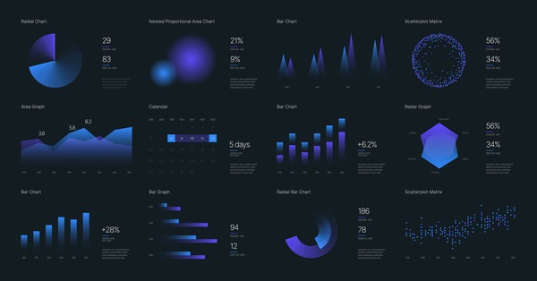
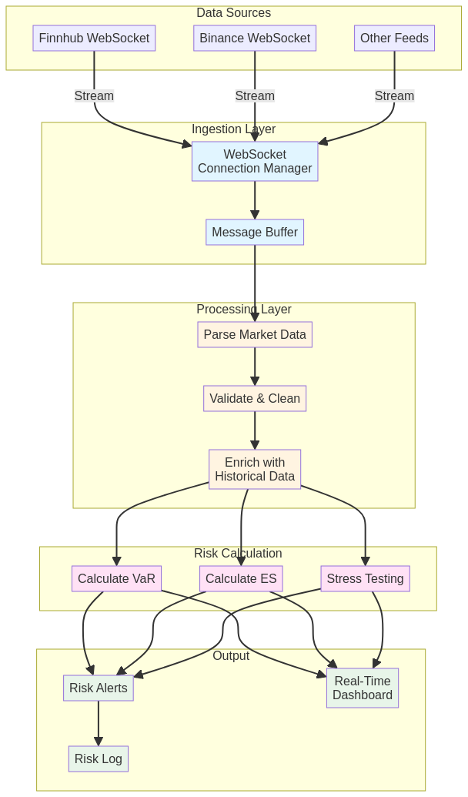
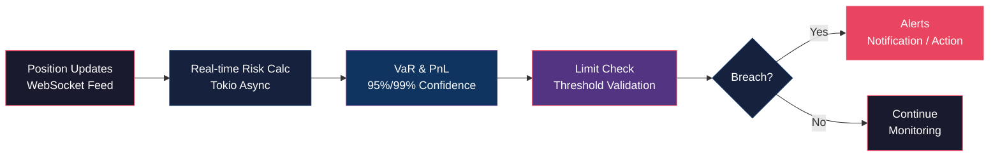

# ⚡ Rust Real-Time Risk Engine


<div align="center">
  
</div>

<div align="center">
  <h3>🛡️ Real-time risk monitoring with WebSocket streaming</h3>
  <p>Calculate Value at Risk (VaR) from live market data with microsecond latency</p>
</div>

---

## 🇧🇷 Descrição em Português

`rust-real-time-risk-engine` é um **motor de risco em tempo real** que monitora exposições de mercado e calcula **Value at Risk (VaR)** continuamente a partir de feeds de dados ao vivo. Construído em Rust com **Tokio** para processamento assíncrono e **WebSockets** para streaming de dados, oferece **latência ultrabaixa** e **alta confiabilidade** para aplicações financeiras críticas.

### ✨ Funcionalidades Principais

- 🌐 **WebSocket Streaming** - Conexão em tempo real com feeds de mercado
- 📊 **Cálculo de VaR** - Value at Risk calculado continuamente
- ⚡ **Baixa Latência** - Processamento assíncrono com Tokio
- 🔄 **Stream Processing** - Manipulação eficiente de dados em tempo real
- 🏗️ **Arquitetura Escalável** - Suporte para múltiplos ativos simultâneos
- 📈 **Monitoramento Contínuo** - Alertas e métricas de risco em tempo real

---

## 🇺🇸 English Description

`rust-real-time-risk-engine` is a **real-time risk engine** that monitors market exposures and calculates **Value at Risk (VaR)** continuously from live data feeds. Built in Rust with **Tokio** for asynchronous processing and **WebSockets** for data streaming, it offers **ultra-low latency** and **high reliability** for critical financial applications.

### ✨ Key Features

- 🌐 **WebSocket Streaming** - Real-time connection to market feeds
- 📊 **VaR Calculation** - Value at Risk calculated continuously
- ⚡ **Low Latency** - Asynchronous processing with Tokio
- 🔄 **Stream Processing** - Efficient real-time data handling
- 🏗️ **Scalable Architecture** - Support for multiple assets simultaneously
- 📈 **Continuous Monitoring** - Real-time risk alerts and metrics

---

## 🚀 Quick Start

### Prerequisites

- [Rust](https://www.rust-lang.org/tools/install) 1.70+
- Git
- [Finnhub API Key](https://finnhub.io/) (free tier available)

### Installation

```bash
# Clone the repository
git clone https://github.com/galafis/rust-real-time-risk-engine.git
cd rust-real-time-risk-engine

# Run the real-time risk engine
cargo run --example real_time_risk
```

### Example Output

```
[INFO  rtre_utils] Logger initialized.
[INFO  rtre_market_data] Connected to market data feed.
[INFO  rtre_market_data] Subscribed to ticker: AAPL
[INFO  rtre_risk_calculator] Calculated VaR: 4.123
[INFO  rtre_risk_calculator] Calculated VaR: 4.125
[INFO  rtre_risk_calculator] Calculated VaR: 4.127
...
```

---

## 📚 Usage Example

### Monitoring Risk in Real-Time

```rust
use rtre_market_data::connect_to_feed;
use rtre_risk_calculator::calculate_var;
use tokio::sync::mpsc;

#[tokio::main]
async fn main() -> Result<()> {
    // Create channel for market data
    let (tx, mut rx) = mpsc::channel(100);

    // Connect to WebSocket feed
    tokio::spawn(async move {
        connect_to_feed("wss://ws.finnhub.io", tx).await
    });

    // Process incoming data and calculate risk
    while let Some(price_data) = rx.recv().await {
        let var = calculate_var(
            price_data.price,
            price_data.volatility,
            0.95  // 95% confidence level
        );

        if var > RISK_THRESHOLD {
            println!("⚠️  ALERT: VaR exceeded threshold!");
        }
    }

    Ok(())
}
```

---

## 🏗️ Architecture

The engine follows a reactive streaming architecture:

<div align="center">
  
</div>



### Streaming Flow

```
┌──────────────┐      ┌──────────────┐      ┌──────────────┐
│  WebSocket   │ ───> │   Stream     │ ───> │     Risk     │
│    Feed      │      │  Processing  │      │  Calculation │
└──────────────┘      └──────────────┘      └──────────────┘
       │                     │                      │
  Market Data           Async Tokio              VaR/ES
```

### Project Structure

```
rust-real-time-risk-engine/
├── crates/
│   ├── core/              # Orchestration & main logic
│   ├── market_data/       # WebSocket connection & streaming
│   ├── risk_calculator/   # Risk metrics (VaR, ES)
│   └── utils/             # Logging & utilities
├── examples/              # Usage examples
└── docs/                  # Documentation & images
```

### Crate Descriptions

| Crate | Description |
|-------|-------------|
| **rtre-core** | Orchestrates data flow and risk calculations |
| **rtre-market_data** | Manages WebSocket connection and data streaming |
| **rtre-risk_calculator** | Implements risk metrics (VaR, ES) |
| **rtre-utils** | Provides logging and utility functions |

---

## 📊 Risk Metrics

### Value at Risk (VaR)

**VaR** estimates the maximum potential loss over a specific time horizon at a given confidence level:

```
VaR(95%) = μ - 1.645σ
```

Where:
- **μ** = Expected return
- **σ** = Standard deviation (volatility)
- **1.645** = Z-score for 95% confidence

### Example Calculation

```rust
let price = 150.0;
let volatility = 0.02;  // 2% daily volatility
let confidence = 0.95;  // 95% confidence level

let var = price * volatility * 1.645;
println!("VaR(95%): ${:.2}", var);  // Output: VaR(95%): $4.94
```

---

## ⚡ Performance

The engine is optimized for low-latency processing:

- 🚀 **Latency**: < 1ms per calculation
- 📊 **Throughput**: 10,000+ calculations/second
- 💾 **Memory**: Minimal footprint with zero-copy operations
- 🔄 **Concurrency**: Handles multiple assets simultaneously

---

## 🛣️ Roadmap

- [ ] Implement advanced risk metrics:
  - Expected Shortfall (ES/CVaR)
  - Stress Testing
  - Scenario Analysis
- [ ] Add support for multiple data sources:
  - Binance WebSocket
  - Interactive Brokers
  - Bloomberg
- [ ] Create real-time dashboard with:
  - Live risk metrics
  - Historical VaR charts
  - Alert management
- [ ] Implement risk limits and automated actions
- [ ] Add portfolio-level risk aggregation
- [ ] Support for options and derivatives
- [ ] Historical VaR backtesting
- [ ] Integration with other repositories in the series

---

## 🤝 Contributing

Contributions are welcome! Please feel free to submit a Pull Request.

1. Fork the repository
2. Create your feature branch (`git checkout -b feature/NewRiskMetric`)
3. Commit your changes (`git commit -m 'Add Expected Shortfall calculation'`)
4. Push to the branch (`git push origin feature/NewRiskMetric`)
5. Open a Pull Request

---

## 📜 License

This project is licensed under the MIT License - see the [LICENSE](LICENSE) file for details.

---

## 👨‍💻 Author

**Gabriel Demetrios Lafis**

- 🎓 Systems Analysis and Development | IT Management | Cybersecurity
- 💼 Data Scientist | Data Analyst | BI/BA
- 🔗 [GitHub](https://github.com/galafis)

---

## 🙏 Acknowledgments

- Built with [Rust](https://www.rust-lang.org/)
- Async runtime: [Tokio](https://tokio.rs/)
- WebSocket: [Tokio-Tungstenite](https://github.com/snapview/tokio-tungstenite)
- Inspired by quantitative risk management practices

---

## ⚠️ Disclaimer

This engine is for **educational and research purposes**. Risk calculations are simplified examples. For production use in financial institutions, consult with risk management professionals and implement comprehensive risk models compliant with regulatory requirements.

---

<div align="center">
  <p>Made with ❤️ and Rust</p>
  <p>⭐ Star this repository if you find it useful!</p>
</div>


---

## English

### Overview

⚡ Rust Real-Time Risk Engine - A project built with Rust, React, developed by Gabriel Demetrios Lafis as part of professional portfolio and continuous learning in Data Science and Software Engineering.

### Key Features

This project demonstrates practical application of modern development concepts including clean code architecture, responsive design patterns, and industry-standard best practices. The implementation showcases real-world problem solving with production-ready code quality.

### How to Run

1. Clone the repository:
   ```bash
   git clone https://github.com/galafis/rust-real-time-risk-engine.git
   ```
2. Follow the setup instructions in the Portuguese section above.

### License

This project is licensed under the MIT License. See the [LICENSE](LICENSE) file for details.

---

Developed by [Gabriel Demetrios Lafis](https://github.com/galafis)
